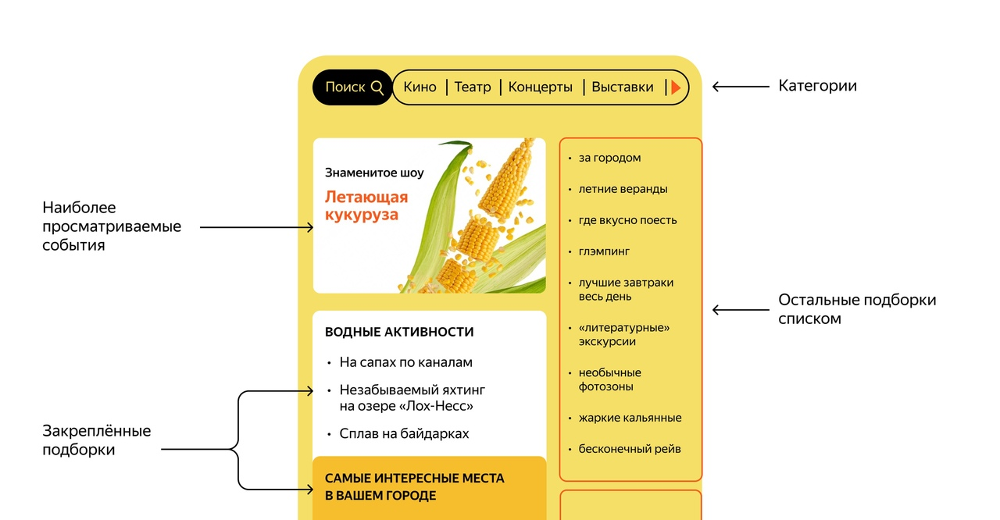

# java-explore-with-me
###### Пэт проект в рамках учебной программы Яндекс.

## Описание:

Бэкенд сервиса, который позволяет находить интересные мероприятия вокруг себя, а также размещать свои. Пример интерфейса:

Архитектура приложения представлена двумя частями, взаимодействующими между собой: основной сервис и сервис статистики. 

#### API основного сервиса разделён на три части:

Публичное API, доступна без регистрации любому пользователю сети. Его функционал:
* Сортировка списка событий по количеству просмотров или датам событий
* Просмотр подробной информации о конкретном событии.
* Возможность получения всех имеющихся категорий и подборок событий (такие подборки могут составлять администраторы ресурса).
* Каждый публичный запрос для получения списка событий или полной информации о мероприятии фиксируется сервисом статистики.

Закрытое API, доступна только авторизованным пользователям:
* Пользователи могут добавлять в приложение новые мероприятия, редактировать их и просматривать после добавления.
* Могут подавать заявки на участие в интересующих мероприятиях.
* Создатель мероприятия имеет возможность подтверждать заявки, которые отправили другие пользователи сервиса.

Административное API, для администраторов сервиса:
* Добавление, изменение и удаление категорий событий.
* Возможность добавлять, удалять и закреплять на главной странице подборки мероприятий.
* Модерация событий, размещённых пользователями, — публикация или отклонение.
* Управление пользователями — добавление, просмотр и удаление.

#### Сервис статистики:
* Информация о количестве обращений пользователей к спискам событий. 
* Информация о количестве запросов к подробной информации о событии. 
* Отчет по собраной информации.

## Спецификация:

Спецификации [основного сервиса](https://raw.githubusercontent.com/yandex-praktikum/java-explore-with-me/main/ewm-main-service-spec.json) и [сервиса статистики](https://raw.githubusercontent.com/yandex-praktikum/java-explore-with-me/main/ewm-stats-service-spec.json) можно посмотреть с помощью [Swagger](https://editor-next.swagger.io)

## Шаблоны проектирования:

В приложении применяется один из шаблонов проектирования -  Data Transfer Object(DTO Pattern).

## Тестирование проекта:

Проверить работоспособность приложения, можно с помощью [готовой коллекции тестов](), например в Postman.
